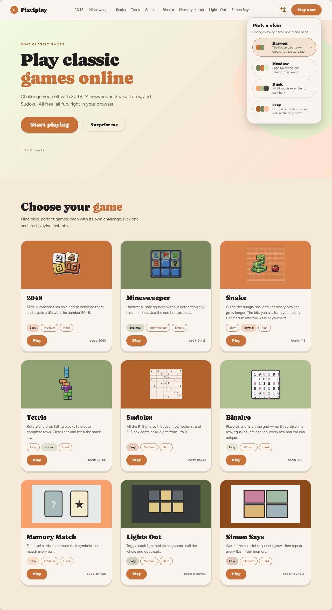

# PixelPlay — Web Game Portal

A colorful, retro-pixel arcade that brings ten browser games together in one responsive React application. Jump straight into an arcade classic, tackle a logic puzzle, or test your memory—no account or installation required.

## Organic Theme Preview

<p align="center">
  
  <br>
  <em>Organic theme concept — Harvest skin. This handoff mockup predates Gate Grid.</em>
</p>

## Games

| Game | Challenge |
| --- | --- |
| **2048** | Slide and merge matching tiles to reach 2048. |
| **Minesweeper** | Use numbered clues to uncover every safe square. |
| **Snake** | Collect binary bits, grow longer, and avoid collisions. |
| **Tetris** | Arrange falling pieces, clear lines, and keep the stack low. |
| **Sudoku** | Complete a 9×9 grid without repeating digits in any row, column, or box. |
| **Binairo** | Balance 0s and 1s while keeping every row and column unique. |
| **Gate Grid** | Configure logic gates and inverters to match a target truth table. |
| **Memory Match** | Find every matching pair in as few moves as possible. |
| **Lights Out** | Toggle neighboring lights until the entire board goes dark. |
| **Simon Says** | Memorize and repeat a sequence that grows each round. |

## Highlights

- Eleven games spanning arcade, number, logic, coding, and memory challenges
- Responsive layouts with keyboard and pointer or touch input
- Multiple difficulty or board-size options on supported games
- Locally saved best scores, rounds, moves, or times where available
- Lazy-loaded game routes for a smaller initial bundle
- A shared retro-pixel interface with animated transitions and reusable game components

## Tech Stack

- **React 19** and **TypeScript 5.9**
- **Vite 7** for development and production builds
- **Tailwind CSS 3.4** with shadcn/ui and Radix UI primitives
- **React Router 7** with hash-based routing for static hosting
- **GSAP** for animation and **Lucide React** for icons
- **ESLint 9** with TypeScript and React Hooks rules

## Getting Started

### Requirements

- Node.js `^20.19.0` or `>=22.12.0`
- npm

### Install and run

```bash
git clone https://github.com/jimjamscott22/Web-Game-Portal.git
cd Web-Game-Portal/app
npm install
npm run dev
```

Vite will print the local development URL: `http://localhost:3000`.

### Quick-start scripts

From the repository root, the launchers install dependencies when needed and
then start the Vite development server:

**Windows**

```powershell
.\start.bat
```

**Linux**

```bash
bash ./start.sh
```

Any additional arguments are forwarded to Vite. For example, use
`bash ./start.sh --host 0.0.0.0` or `.\start.bat --host 0.0.0.0` to expose the
development server on your local network.

## Available Scripts

Run these commands from `app/`:

| Command | Purpose |
| --- | --- |
| `npm run dev` | Start the Vite development server. |
| `npm run build` | Type-check the application and create a production build in `app/dist/`. |
| `npm run preview` | Serve the production build locally. |
| `npm run lint` | Run ESLint across the application. |

## Project Structure

```text
app/
├── public/
│   └── assets/                 # Game cards, backgrounds, and decorative artwork
├── src/
│   ├── main.tsx                # React entry point and HashRouter setup
│   ├── App.tsx                 # Shared shell, transitions, and lazy-loaded routes
│   ├── pages/                  # Home screen and one page per game
│   ├── sections/               # Home-page hero, game showcase, and call to action
│   ├── components/             # Shared game layout and interface components
│   │   └── ui/                 # shadcn/ui and Radix-based primitives
│   ├── games/
│   │   ├── board2048/
│   │   ├── boardBinairo/
│   │   ├── boardGateGrid/
│   │   ├── boardLightsOut/
│   │   ├── boardMemoryMatch/
│   │   ├── boardMinesweeper/
│   │   ├── boardSimonSays/
│   │   ├── boardSnake/
│   │   ├── boardSudoku/
│   │   └── boardTetris/        # Board components and game-specific logic
│   ├── hooks/                  # Keyboard, swipe, game-loop, and storage hooks
│   ├── lib/                    # Shared utilities
│   └── types/                  # Game registry and shared TypeScript types
├── tests/                      # Targeted regression tests
├── package.json
├── tailwind.config.js
├── vite.config.ts
└── tsconfig*.json
```

## Architecture

Each game has a route-level page in `src/pages/` and a dedicated folder in `src/games/`. Page components own presentation concerns such as scores, difficulty controls, and overlays. Board components handle interaction and delegate reusable rules or puzzle generation to their neighboring `gameLogic.ts` modules.

Shared components provide consistent headers, controls, score displays, instructions, and win or game-over states. Common hooks centralize keyboard input, swipe gestures, animation loops, and local-storage access.

## Verification

Create a production build:

```bash
cd app
npm run build
```

Run the targeted 2048 game-logic regression tests:

```bash
cd app
node --experimental-strip-types --test tests/gameLogic.test.ts
```

## Deployment

`npm run build` produces a static application in `app/dist/`. The hash-based routes work without server-side rewrite rules, so the directory can be deployed to services such as GitHub Pages, Netlify, Vercel, or an object-storage static host.
